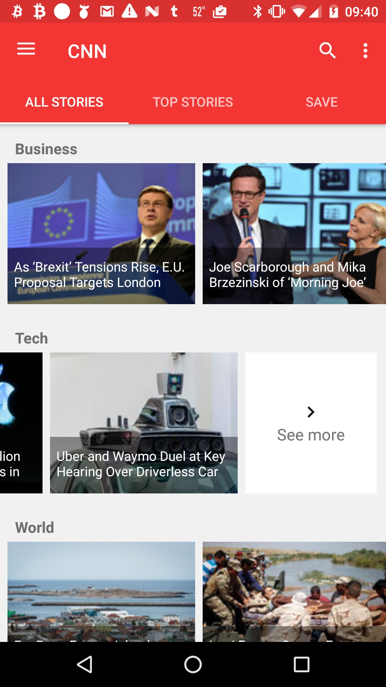
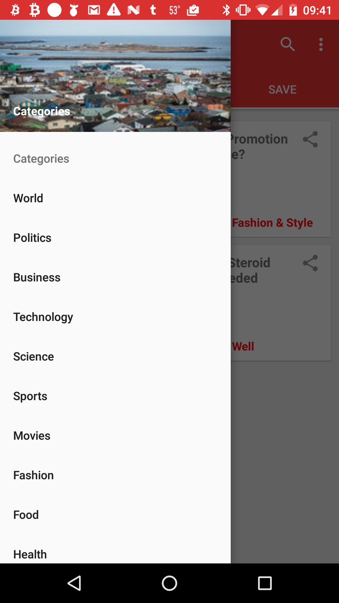
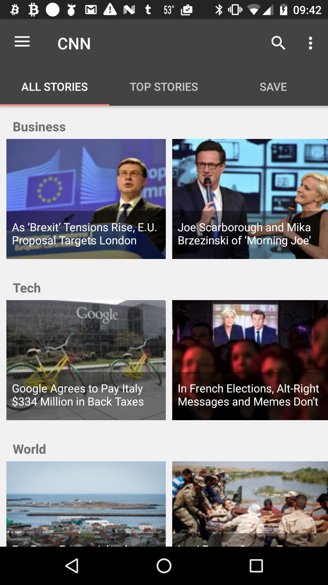

#  Project #3

#### Overview

##### Team members - Will, Ivonne, Sam

Our app for this project is a news reader based on the New York Times API per the following specifications:

* [CNN](CNN)

Users can view news as it comes out based on category, and they can view top news items in a continuous stream. Users can also share articles via social media. The app periodically checks for new articles, and the user can also manually check for updates.

---

#### Functionality

When the app first opens, it takes the user to a loading page, which checks the server for new articles, which will be available for reading once the check is complete. This check can take additional time based on how long it has been since the last load. Articles downloaded during this check are stored in a database for quick access. Part of the download process checks to see whether articles are already in the database, so as not to add duplicates.

Once the initial load has been completed the user is taken to the main activity, which has three primary tabs in a `ViewPager`: All stories, Top stories, and Save. All stories contains categorized horizontal scrolling `RecyclerView`s of news thumbnails, all nested within a standard vertical scrolling `RecyclerView`. Each row of articles contains five thumbnails. At the end of the row is a button that takes the user to a full list of all items in that category. Any item in these category views can be saved, shared, or opened and read.

The Top stories tab contains a single `RecyclerView` containing all of the collected top news items. Each item in this tab displays a thumbnail, the title, the date of publication, the category, and buttons for sharing and saving. Tapping the save button, shaped like a heart, adds the article to the saved articles list, while tapping the share button brings up a share using chooser.

The Save tab contains a list of all items the user has saved. Tapping the share button brings up a share using chooser. Swiping left on an article in this view removes it from the saved list. Removing an article from the saved list brings up a `SnackBar` giving the user the option to undo this action.

Tapping on any article opens up its detail view. The detail view contains the article’s image, publication date, title, first paragraph, and URL. Tapping the URL opens the full contents of the article in a `WebView`. Swiping left or right while in an article’s detail view opens up the next or previous article in that category, respectively. While in detail view the user can also share an article or add and remove it from their saved articles list.

Users can share articles from this app to various social media platforms or other apps via an `Intent`. Tapping the share button brings up a share using chooser, which will present the user with all of the applicable options on their device for sharing content.

On the left side of the app is a navigation drawer, which is accessible from any view except search. The navigation drawer allows quick access to all of the assorted categories of articles.

When a new top story is downloaded into the database, a notification is displayed. The notification contains the headline of the article and a button. Clicking the notification will immediately open the detail view for the article, while clicking the button will add the article to the user’s saved articles list.

The main activity contains a search button that takes the user to a separate search activity. In this activity the user can search for articles by title or category.

The app contains a settings page accessible from the top right corner of the main activity and detail view. The user can choose whether they want a red or black theme for the app, or whether they want notifications to be displayed.

In the `OnCreate` method of the main activity, a background service is started that will automatically check for new articles as long as the device is plugged in and connected to a wireless network. If the user would like to refresh the article list manually, they can pull down to refresh while on the All stories or Top stories tabs to the main activity.

---

#### Known bugs

- Due to relatively low number of allotted Top Stories API calls, 1000 per day, the daily limit can be reached and result in errors.

---

#### Screenshots

	
	
	
	
	
	
	
	
	
	
	
	

